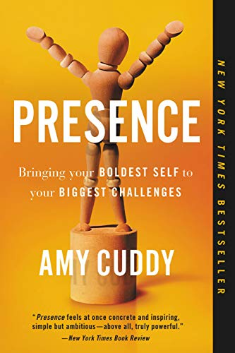
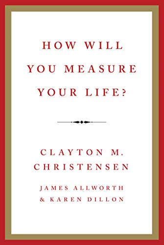
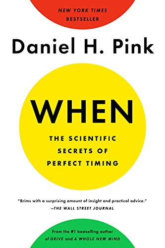

# books
Books i have read.

[goodreads: bya](https://www.goodreads.com/user/show/5663794-bya)

# 2019

## March

### Presence: Bringing Your Boldest Self to Your Biggest Challenges

  

Have you ever left a nerve-racking challenge and immediately wished for a do over? Maybe after a job interview, a performance, or a difficult conversation? The very moments that require us to be genuine and commanding can instead cause us to feel phony and powerless. Too often we approach our lives' biggest hurdles with dread, execute them with anxiety, and leave them with regret. 

- [goodreads](https://www.goodreads.com/book/show/35054415-presence)
- [amazon](https://www.amazon.com/gp/product/B0196KW67Y/ref=x_gr_w_bb?ie=UTF8&tag=x_gr_w_bb-20&linkCode=as2&camp=1789&creative=9325&creativeASIN=B0196KW67Y&SubscriptionId=1MGPYB6YW3HWK55XCGG2)

## February

### How Will You Measure Your Life?

  

In 2010 world-renowned innovation expert Clayton M. Christensen gave a powerful speech to the Harvard Business School's graduating class. Drawing upon his business research, he offered a series of guidelines for finding meaning and happiness in life. He used examples from his own experiences to explain how high achievers can all too often fall into traps that lead to unhappiness.

- [goodreads](https://www.goodreads.com/book/show/15852325-how-will-you-measure-your-life)
- [amazon](https://www.amazon.com/gp/product/B006ID0CH4/ref=x_gr_w_bb?ie=UTF8&tag=x_gr_w_bb-20&linkCode=as2&camp=1789&creative=9325&creativeASIN=B006ID0CH4&SubscriptionId=1MGPYB6YW3HWK55XCGG2)

## January

### When: The Scientific Secrets of Perfect Timing

  

Everyone knows that timing is everything. But we don't know much about timing itself. Our lives are a never-ending stream of "when" decisions: when to start a business, schedule a class, get serious about a person. Yet we make those decisions based on intuition and guesswork.

- [goodreads](https://www.goodreads.com/book/show/35786699-when)
- [amazon](https://www.amazon.com/gp/product/B072Q985YX/ref=x_gr_w_bb?ie=UTF8&tag=x_gr_w_bb-20&linkCode=as2&camp=1789&creative=9325&creativeASIN=B072Q985YX&SubscriptionId=1MGPYB6YW3HWK55XCGG2)
