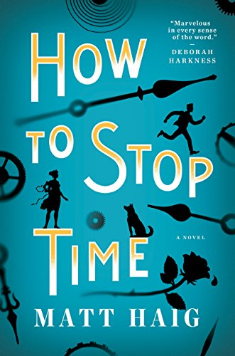
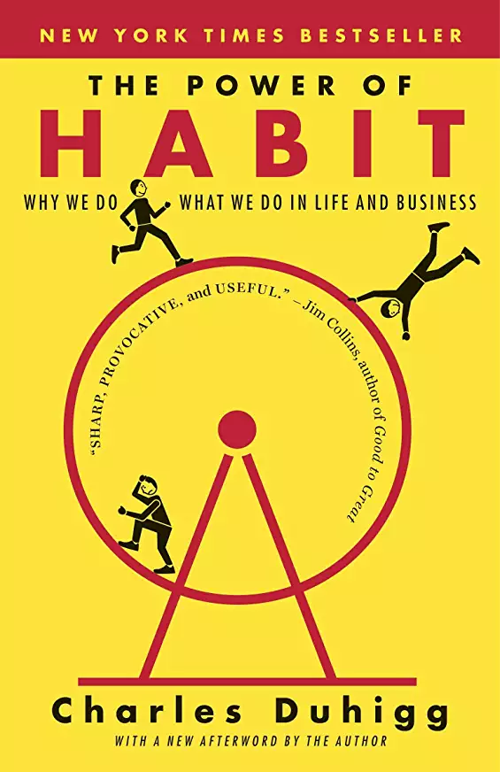
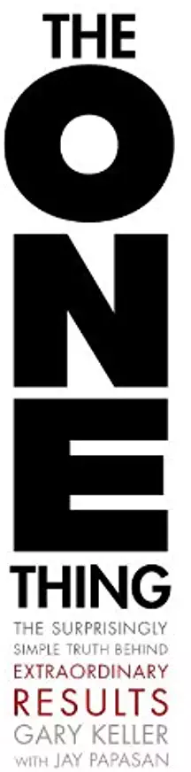

# books
Books i have read.

[goodreads: bya](https://www.goodreads.com/user/show/5663794-bya)

# 2019

## Presence: Bringing Your Boldest Self to Your Biggest Challenges

  

Have you ever left a nerve-racking challenge and immediately wished for a do over? Maybe after a job interview, a performance, or a difficult conversation? The very moments that require us to be genuine and commanding can instead cause us to feel phony and powerless. Too often we approach our lives' biggest hurdles with dread, execute them with anxiety, and leave them with regret. 

- [goodreads](https://www.goodreads.com/book/show/35054415-presence)
- [amazon](https://www.amazon.com/gp/product/B0196KW67Y/ref=x_gr_w_bb?ie=UTF8&tag=x_gr_w_bb-20&linkCode=as2&camp=1789&creative=9325&creativeASIN=B0196KW67Y&SubscriptionId=1MGPYB6YW3HWK55XCGG2)

## How Will You Measure Your Life?

  

In 2010 world-renowned innovation expert Clayton M. Christensen gave a powerful speech to the Harvard Business School's graduating class. Drawing upon his business research, he offered a series of guidelines for finding meaning and happiness in life. He used examples from his own experiences to explain how high achievers can all too often fall into traps that lead to unhappiness.

- [goodreads](https://www.goodreads.com/book/show/15852325-how-will-you-measure-your-life)
- [amazon](https://www.amazon.com/gp/product/B006ID0CH4/ref=x_gr_w_bb?ie=UTF8&tag=x_gr_w_bb-20&linkCode=as2&camp=1789&creative=9325&creativeASIN=B006ID0CH4&SubscriptionId=1MGPYB6YW3HWK55XCGG2)

## When: The Scientific Secrets of Perfect Timing

  

Everyone knows that timing is everything. But we don't know much about timing itself. Our lives are a never-ending stream of "when" decisions: when to start a business, schedule a class, get serious about a person. Yet we make those decisions based on intuition and guesswork.

- [goodreads](https://www.goodreads.com/book/show/35786699-when)
- [amazon](https://www.amazon.com/gp/product/B072Q985YX/ref=x_gr_w_bb?ie=UTF8&tag=x_gr_w_bb-20&linkCode=as2&camp=1789&creative=9325&creativeASIN=B072Q985YX&SubscriptionId=1MGPYB6YW3HWK55XCGG2)

# 2018

## How to Stop Time

  

Tom Hazard has a dangerous secret. He may look like an ordinary 41-year-old, but owing to a rare condition, he's been alive for centuries. Tom has lived history--performing with Shakespeare, exploring the high seas with Captain Cook, and sharing cocktails with Fitzgerald. Now, he just wants an ordinary life. 

- [goodreads](https://www.goodreads.com/book/show/35381379-how-to-stop-time)
- [amazon](https://www.amazon.com/gp/product/B072Q8WX9K/ref=x_gr_w_bb?ie=UTF8&tag=x_gr_w_bb-20&linkCode=as2&camp=1789&creative=9325&creativeASIN=B072Q8WX9K&SubscriptionId=1MGPYB6YW3HWK55XCGG2)

## The Subtle Art of Not Giving a F*ck: A Counterintuitive Approach to Living a Good Life

  

For decades, we’ve been told that positive thinking is the key to a happy, rich life. "Fuck positivity," Mark Manson says. "Let’s be honest, shit is fucked and we have to live with it." In his wildly popular Internet blog, Manson doesn’t sugarcoat or equivocate. He tells it like it is—a dose of raw, refreshing, honest truth that is sorely lacking today. The Subtle Art of Not Giving a Fuck is his antidote to the coddling, let’s-all-feel-good mindset that has infected American society and spoiled a generation, rewarding them with gold medals just for showing up.

- [goodreads](https://www.goodreads.com/book/show/29965800-the-subtle-art-of-not-giving-a-f-ck)
- [amazon](https://www.amazon.com/gp/product/B019MMUA8S/ref=x_gr_w_bb?ie=UTF8&tag=x_gr_w_bb-20&linkCode=as2&camp=1789&creative=9325&creativeASIN=B019MMUA8S&SubscriptionId=1MGPYB6YW3HWK55XCGG2)

## The Power Of Habit: Why We Do What We Do In Life And Business

  

A young woman walks into a laboratory. Over the past two years, she has transformed almost every aspect of her life. She has quit smoking, run a marathon, and been promoted at work. The patterns inside her brain, neurologists discover, have fundamentally changed.

- [gooreads](https://www.goodreads.com/book/show/12609434-the-power-of-habit)
- [amazon](https://www.amazon.com/s?k=The+Power+Of+Habit&i=stripbooks&adid=082VK13VJJCZTQYGWWCZ&campaign=211041&creative=374001&tag=x_gr_w_bb-20&ref=x_gr_w_bb)

## The One Thing: The Surprisingly Simple Truth Behind Extraordinary Results

  

You want fewer distractions and less on your plate. The daily barrage of e-mails, texts, tweets, messages, and meetings distract you and stress you out. The simultaneous demands of work and family are taking a toll. And what's the cost? Second-rate work, missed deadlines, smaller pay cheques, fewer promotions-and lots of stress.

- [goodreads](https://www.goodreads.com/book/show/18931341-the-one-thing)
- [amazon](https://www.amazon.com/s?k=9781848549234&i=stripbooks&linkCode=qs&tag=x_gr_w_bb-20&ref=x_gr_w_bb)
